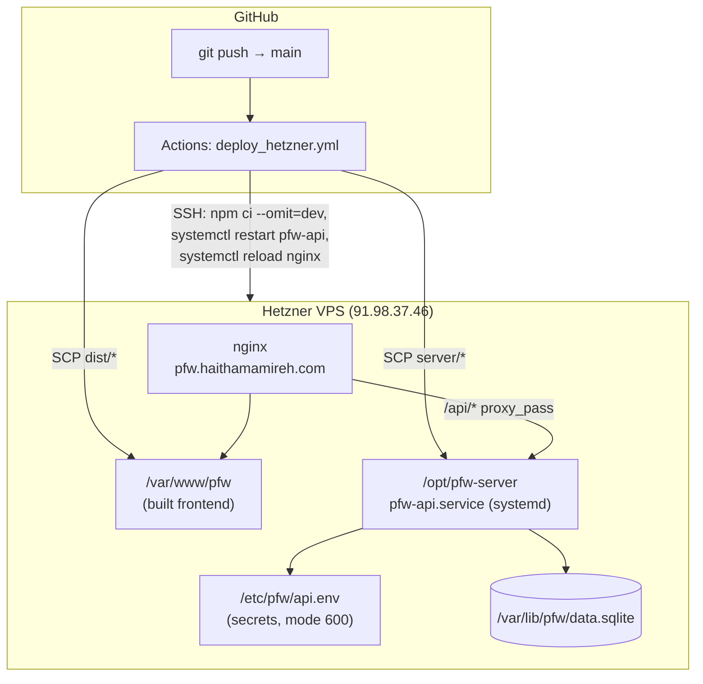

# Deployment

This app runs on a single Hetzner VPS you already manage (`Personal-Projects`, alongside several other sites), fronted by nginx with an existing Let's Encrypt cert for `pfw.haithamamireh.com`. There is no separate staging environment or managed database — it's one server, one SQLite file, one systemd service.



---

## Contents

- [One-time server setup](#one-time-server-setup)
- [nginx configuration](#nginx-configuration)
- [GitHub Actions (CI/CD)](#github-actions-cicd)
- [Required GitHub secrets](#required-github-secrets)
- [Manual deploy](#manual-deploy-no-ci)
- [Operations](#operations)
- [Managing users / the invite code](#managing-users--the-invite-code)
- [Troubleshooting](#troubleshooting)
- [Security notes](#security-notes)

---

## One-time server setup

Everything below was already run against the live server. It's documented here so it's reproducible (new server, disaster recovery) rather than living only in shell history.

### 1. Node.js

The backend needs Node 20+. Installed via NodeSource:

```bash
curl -fsSL https://deb.nodesource.com/setup_22.x | bash -
apt-get install -y nodejs
node -v   # v22.x
```

### 2. Directories

```bash
mkdir -p /opt/pfw-server   # backend source, overwritten on every deploy
mkdir -p /var/lib/pfw      # SQLite database — NOT in the deploy path, survives redeploys
mkdir -p /etc/pfw          # secrets, mode 600
```

### 3. Secrets (`/etc/pfw/api.env`)

```bash
JWT_SECRET=$(openssl rand -hex 32)
SIGNUP_CODE=$(openssl rand -hex 6)

cat > /etc/pfw/api.env <<EOF
JWT_SECRET=$JWT_SECRET
DB_PATH=/var/lib/pfw/data.sqlite
PORT=3001
NODE_ENV=production
SIGNUP_CODE=$SIGNUP_CODE
EOF
chmod 600 /etc/pfw/api.env
```

| Key | Purpose |
|---|---|
| `JWT_SECRET` | Signs session cookies. **Rotating this logs every user out.** Never commit it, never let it appear in CI logs. |
| `DB_PATH` | Deliberately outside `/opt/pfw-server` — that directory gets wiped and re-synced by every deploy (`rsync --delete`). |
| `SIGNUP_CODE` | Gate on `/api/auth/register`. Change it any time by editing this file and restarting the service (see [Managing users](#managing-users--the-invite-code)). |

### 4. systemd service

`/etc/systemd/system/pfw-api.service`:

```ini
[Unit]
Description=Personal Wallet API
After=network.target

[Service]
Type=simple
WorkingDirectory=/opt/pfw-server
EnvironmentFile=/etc/pfw/api.env
ExecStart=/usr/bin/node src/index.js
Restart=on-failure
RestartSec=3

[Install]
WantedBy=multi-user.target
```

```bash
systemctl daemon-reload
systemctl enable pfw-api
```

`ExecStart` assumes Node lives at `/usr/bin/node` (true for the NodeSource install above — confirm with `which node` if it was installed differently, e.g. via nvm, which systemd's minimal `PATH` won't see).

---

## nginx configuration

`/etc/nginx/sites-available/personalWallet` (symlinked into `sites-enabled`):

```nginx
# HTTPS site
server {
  listen 443 ssl http2;
  server_name pfw.haithamamireh.com;

  root   /var/www/pfw;
  index  index.html;

  ssl_certificate     /etc/letsencrypt/live/pfw.haithamamireh.com/fullchain.pem;
  ssl_certificate_key /etc/letsencrypt/live/pfw.haithamamireh.com/privkey.pem;

  location /api/ {
    proxy_pass http://127.0.0.1:3001;
    proxy_set_header Host $host;
    proxy_set_header X-Real-IP $remote_addr;
    proxy_set_header X-Forwarded-For $proxy_add_x_forwarded_for;
    proxy_set_header X-Forwarded-Proto $scheme;
  }

  location / {
    try_files $uri $uri/ =404;
  }
}
```

Notes:
- No `location /api/` trailing path on `proxy_pass` (i.e. `http://127.0.0.1:3001`, not `.../api/`) — nginx forwards the original URI unchanged, which lines up with Express routes being mounted at `/api/...`.
- `try_files $uri $uri/ =404` is sufficient because the app uses `HashRouter` (`#/analytics`, etc.) — the fragment never reaches the server, so there's no SPA-fallback rewrite to configure.
- This used to have `auth_basic` / `auth_basic_user_file` (a site-wide password gate). That was removed once the app got real per-account login — keeping both meant double-authentication and risked interfering with PWA install / service-worker fetches.
- **Always** back up before editing (`cp personalWallet personalWallet.bak-$(date +%s)`), and **always** run `nginx -t` before `systemctl reload nginx`. This server hosts several other sites (`apex-legends-api`, `sorapalette`, `haithamamireh`, etc.) via the same nginx instance — never touch another site's file, and a config error here can be caught by `nginx -t` before it takes anything down.

---

## GitHub Actions (CI/CD)

`.github/workflows/deploy_hetzner.yml` runs on every push to `main`:

1. Checkout, `npm ci`, `npm run build` (frontend).
2. SCP `dist/*` → `${{ secrets.DEPLOY_PATH }}` (`/var/www/pfw`), `strip_components: 1`, `overwrite: true`.
3. SCP `server/*` → `${{ secrets.API_DEPLOY_PATH }}` (`/opt/pfw-server`), same flags.
4. SSH in and run:
   ```bash
   cd $API_DEPLOY_PATH
   npm ci --omit=dev
   systemctl restart pfw-api
   systemctl reload nginx
   ```

`npm ci` runs **on the server**, not in CI — `better-sqlite3` is a native module, and building it on the actual target machine avoids any glibc/arch mismatch between GitHub's runner and the VPS.

### Required GitHub secrets

Set these in the repo (Settings → Secrets and variables → Actions):

| Secret | Value |
|---|---|
| `HETZNER_HOST` | `91.98.37.46` |
| `HETZNER_USER` | `root` |
| `HETZNER_SSH_KEY` | Private key authorized in `root`'s `~/.ssh/authorized_keys` on the server |
| `DEPLOY_PATH` | `/var/www/pfw` |
| `API_DEPLOY_PATH` | `/opt/pfw-server` |

---

## Manual deploy (no CI)

Useful for a hotfix, or before the GitHub secrets above are wired up. This is exactly what CI does, run by hand from the repo root:

```bash
# 1. Build
npm run build

# 2. Ship the frontend (--delete removes stale hashed assets from old builds)
rsync -avz --delete dist/ root@91.98.37.46:/var/www/pfw/

# 3. Ship the backend (--delete removes files you deleted locally too)
rsync -avz --delete server/src/ root@91.98.37.46:/opt/pfw-server/src/
# only needed if server/package.json changed:
rsync -avz server/package.json server/package-lock.json root@91.98.37.46:/opt/pfw-server/

# 4. Install deps (only if package.json changed) and restart
ssh root@91.98.37.46 "cd /opt/pfw-server && npm ci --omit=dev; systemctl restart pfw-api"

# 5. Verify
curl -s -o /dev/null -w '%{http_code}\n' https://pfw.haithamamireh.com/
curl -s -o /dev/null -w '%{http_code}\n' https://pfw.haithamamireh.com/api/auth/me   # expect 401 (proves the proxy works)
```

If you only changed frontend code, skip steps 3–4. If you only changed backend code, skip step 2.

---

## Operations

The `sqlite3` CLI isn't installed on the server by default (the backend talks to SQLite via the `better-sqlite3` npm package, which doesn't need it) — the backup and user-management commands below need it. One-time install:
```bash
ssh root@91.98.37.46 "apt-get install -y sqlite3"
```

**Check the API is running:**
```bash
ssh root@91.98.37.46 "systemctl status pfw-api --no-pager"
```

**Tail live logs:**
```bash
ssh root@91.98.37.46 "journalctl -u pfw-api -f"
```

**Restart after a manual server-side change:**
```bash
ssh root@91.98.37.46 "systemctl restart pfw-api"
```

**Back up the database** (do this before anything risky — schema changes, bulk edits):
```bash
ssh root@91.98.37.46 "sqlite3 /var/lib/pfw/data.sqlite '.backup /var/lib/pfw/backup-$(date +%Y%m%d).sqlite'"
```
Using `sqlite3 .backup` rather than `cp` matters — the DB runs in WAL mode, so a plain file copy while the service is live can grab an inconsistent snapshot; `.backup` is safe to run against a live database.

**Fetch that backup locally:**
```bash
scp root@91.98.37.46:/var/lib/pfw/backup-YYYYMMDD.sqlite ./
```

---

## Managing users / the invite code

Registration is gated by `SIGNUP_CODE` in `/etc/pfw/api.env`. To change it:

```bash
ssh root@91.98.37.46
vi /etc/pfw/api.env          # edit SIGNUP_CODE
systemctl restart pfw-api
```

To see who's registered (read-only, no password data exposed):
```bash
ssh root@91.98.37.46 "sqlite3 /var/lib/pfw/data.sqlite 'SELECT id, email, created_at FROM users;'"
```

There's no admin UI or user-deletion endpoint yet — removing an account means deleting its row directly (cascades to their expenses/recurring/settings via `ON DELETE CASCADE`):
```bash
ssh root@91.98.37.46 "sqlite3 /var/lib/pfw/data.sqlite \"DELETE FROM users WHERE email = 'someone@example.com';\""
```

---

## Troubleshooting

| Symptom | Check |
|---|---|
| Site loads but every `/api` call 502s or 404s | `systemctl status pfw-api` — is it actually running? `journalctl -u pfw-api -n 50` for the crash reason. |
| `nginx -t` fails after an edit | You broke syntax somewhere — the error message names the line. Restore from the `.bak-*` file next to it and retry. |
| Can't register: "Invalid signup code" | You need the current `SIGNUP_CODE` from `/etc/pfw/api.env`. |
| Can't register: "already exists" | Someone (maybe you, in an earlier test) already used that email — check with the `SELECT ... FROM users` query above. |
| Login works then immediately looks logged out | Almost always a cookie/HTTPS mismatch — confirm `NODE_ENV=production` is actually set in `/etc/pfw/api.env` (controls the cookie's `Secure` flag) and that you're hitting the site over `https://`, not `http://`. |
| Deploy succeeded but the browser shows old content | Hard-refresh — the service worker precaches the app shell. It auto-updates on next load (`registerType: 'autoUpdate'`), but a stubborn cache may need one manual reload to catch up. |
| `npm ci` fails on the server with a `better-sqlite3` build error | Missing build toolchain. `apt-get install -y build-essential python3` and retry. |

---

## Security notes

- Passwords are hashed with bcrypt (cost factor 12) — never stored or logged in plaintext.
- Sessions are JWTs in an `httpOnly`, `Secure` (prod), `SameSite=Lax` cookie — inaccessible to JS, and not sent cross-site.
- `/api/auth/login` is rate-limited to 10 attempts per 15 minutes per IP; `/api/auth/register` to 5 per hour per IP (in-memory limiter — resets on service restart, which is an accepted tradeoff for a single-process personal deployment).
- `/etc/pfw/api.env` is mode `600`, root-only.
- The database file lives outside the web root and outside the deploy path — it's never served as a static file and never touched by a deploy.
