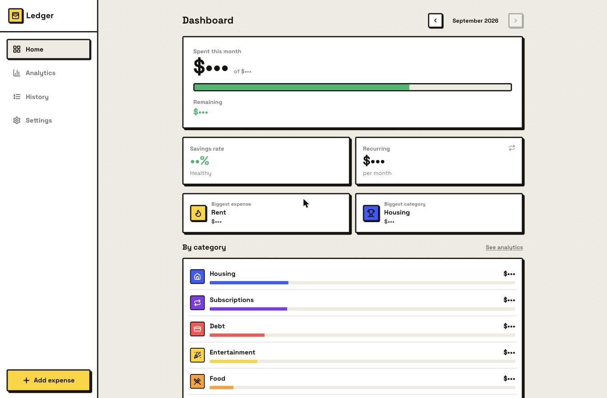
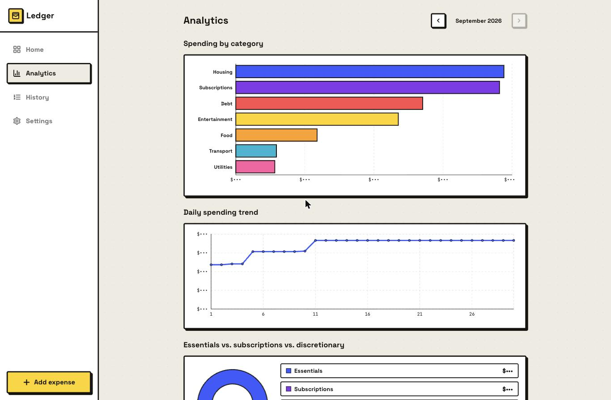
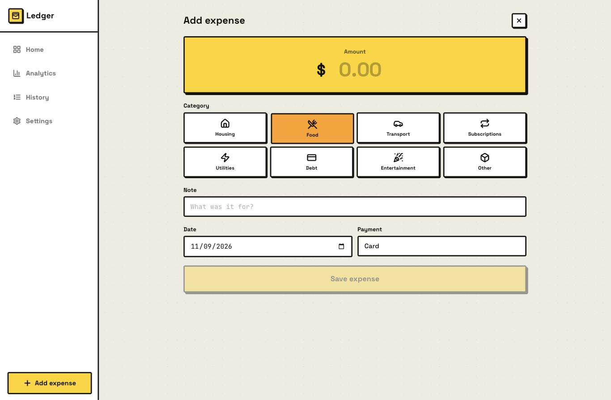
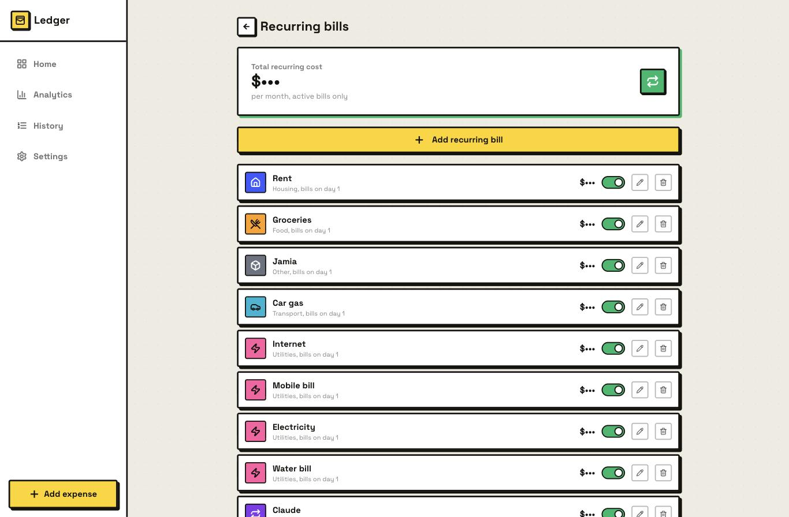
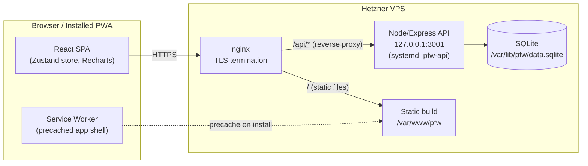
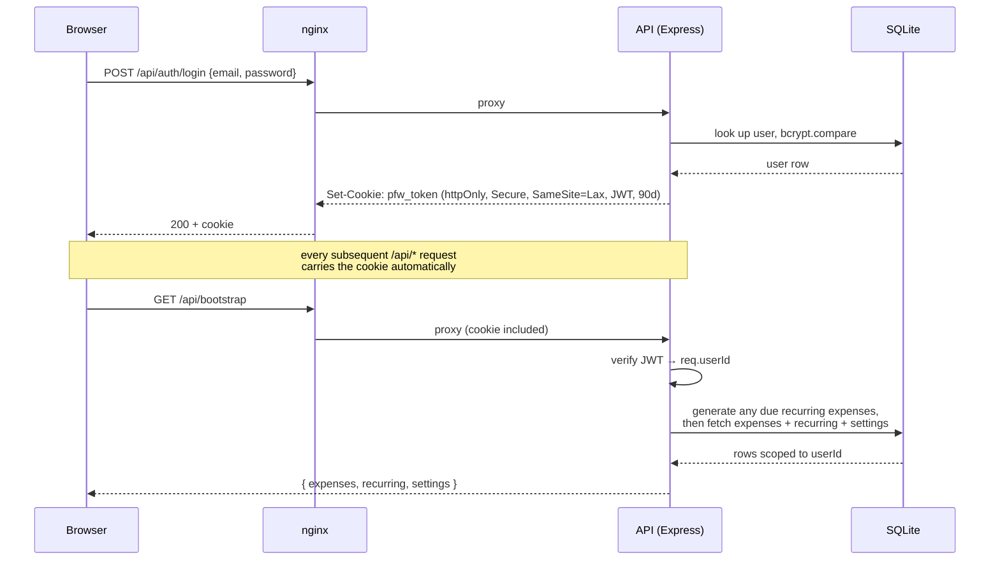

# Ledger — Personal Expense Tracker

A fast, installable, multi-user expense tracker. Log spending in under 10 seconds, manage recurring bills that auto-populate every month, and get real analytics on where the money actually goes — all wrapped in a deliberately loud neo-brutalist UI instead of another soft-SaaS dashboard.

Live at **[pfw.haithamamireh.com](https://pfw.haithamamireh.com)**.

<table>
<tr>
<td width="50%"><br/><sub>Dashboard</sub></td>
<td width="50%"><br/><sub>Analytics</sub></td>
</tr>
<tr>
<td width="50%"><br/><sub>Add expense</sub></td>
<td width="50%"><br/><sub>Recurring bills</sub></td>
</tr>
</table>

More in [`docs/screenshots/`](./docs/screenshots) (budgets & goals, history, settings, the rest of analytics). Dollar amounts and percentages are masked with `$•••` / `••%` — these are screenshots of a real account, and every figure in them is live personal financial data, so numbers are redacted while the actual UI is shown untouched. If you're regenerating these yourself, run this in the browser console before capturing (mirrors what was used to produce the ones checked in here):

```js
(function () {
  const moneyRe = /\$\s?-?\d[\d,]*\.?\d*\s?k?/gi;
  const pctRe = /-?\d+(\.\d+)?%/g;
  const walker = document.createTreeWalker(document.body, NodeFilter.SHOW_TEXT);
  const nodes = [];
  let node;
  while ((node = walker.nextNode())) nodes.push(node);
  for (const n of nodes) {
    n.nodeValue = n.nodeValue.replace(moneyRe, '$•••').replace(pctRe, '••%');
  }
  // input values (e.g. the income field) aren't text nodes — mask separately:
  document.querySelectorAll('input').forEach((el) => {
    if (/\d/.test(el.value)) el.value = '•••';
  });
})();
```

---

## Contents

- [What it does](#what-it-does)
- [Architecture](#architecture)
- [Tech stack](#tech-stack)
- [Project structure](#project-structure)
- [Data model](#data-model)
- [API reference](#api-reference)
- [Design system](#design-system)
- [Local development](#local-development)
- [Environment variables](#environment-variables)
- [Scripts](#scripts)
- [Deployment](#deployment)
- [Known limitations](#known-limitations)

---

## What it does

**Daily entry, fast.** Amount → category (one tap) → optional note → save. Defaults to today's date. Built to be usable one-handed, out and about, in well under 10 seconds.

**Recurring bills that run themselves.** Define rent, subscriptions, and utility bills once (amount, category, day of month). Every time the app loads, it checks for the current month and auto-creates any bill whose day has arrived — you never have to remember to log rent on the 1st.

**A dashboard that answers "how am I doing?" at a glance.** Spent vs. income, remaining budget, month-over-month change, category breakdown, biggest expense/category callouts, savings rate.

**Analytics that are actually useful, not decorative.**
- Bar chart — spend by category
- Line chart — cumulative daily spend this month
- Donut chart — essentials vs. subscriptions vs. discretionary split
- 12-month trend
- Subscription price-change detector (flags when a recurring bill's amount changed)

**Budgets & goals.** Per-category or overall monthly limits with warning/over-budget states; savings goals (e.g. an emergency fund) with progress tracking.

**Full history.** Searchable, filterable (category, date range) log of every entry, with CSV export.

**Real accounts.** Email/password login, each account's data fully isolated server-side. Not a shared password gate — actual per-user data.

**Installable PWA.** Add to home screen on iOS/Android/desktop; runs as a standalone app with its own icon. The app shell works offline; live financial data always requires a connection by design (never silently shows stale numbers for a money app).

---

## Architecture



Frontend and backend are same-origin in production (nginx serves both under `pfw.haithamamireh.com`), so there's no CORS to manage. In local dev, Vite proxies `/api` to the backend running on `:3001` — see [Local development](#local-development).

### Auth flow



---

## Tech stack

| Layer | Choice | Why |
|---|---|---|
| Frontend framework | React 18 + TypeScript, Vite | Fast dev loop, strict typing end to end |
| Styling | Tailwind CSS | Utility-first, fast to hand-build a real design system with |
| State | Zustand | Minimal boilerplate, no Context provider hell |
| Routing | React Router (`HashRouter`) | Hash-based so nginx needs zero SPA-fallback config |
| Charts | Recharts | Composable enough to fully restyle to the brutalist look |
| PWA | `vite-plugin-pwa` (Workbox) | Manifest + service worker generation, `NetworkOnly` for `/api` |
| Backend | Node.js + Express | Small, boring, easy to run as a single systemd service |
| Database | SQLite (`better-sqlite3`) | Zero ops — a file on disk, synchronous API, plenty for personal-scale data |
| Auth | JWT in an httpOnly cookie, bcrypt password hashing | No session store needed; cookie does the work |
| Deploy | GitHub Actions → SCP/SSH → Hetzner VPS | Matches the existing self-hosted setup — see [DEPLOY.md](./DEPLOY.md) |

---

## Project structure

```
.
├── src/                      # frontend (Vite + React + TS)
│   ├── components/
│   │   ├── layout/AppShell.tsx   # nav shell: sticky desktop sidebar, mobile bottom nav
│   │   ├── ui.tsx                # design-system primitives (Card, Button, Badge, ...)
│   │   ├── CategoryPicker.tsx
│   │   ├── ChartTooltip.tsx
│   │   └── MonthSwitcher.tsx
│   ├── lib/
│   │   ├── api.ts            # typed fetch client for the backend
│   │   ├── store.ts          # Zustand store — wallet data, API-backed
│   │   ├── authStore.ts      # Zustand store — session state
│   │   ├── analytics.ts      # pure functions: totals, breakdowns, trends
│   │   ├── categories.ts     # the 8 default categories (icon, color, group)
│   │   ├── types.ts          # shared domain types
│   │   ├── csv.ts, date.ts, format.ts, icons.tsx, useMonthParam.ts
│   ├── pages/                # one file per route
│   │   ├── Dashboard.tsx, Analytics.tsx, AddExpense.tsx, History.tsx,
│   │   │   Recurring.tsx, Budgets.tsx, Settings.tsx, Auth.tsx
│   ├── App.tsx                # auth gate → bootstrap gate → router
│   └── index.css              # design tokens, base layer, reduced-motion handling
│
├── server/                    # backend (Node + Express, plain JS/ESM)
│   ├── src/
│   │   ├── index.js           # app wiring, route mounting, rate limits
│   │   ├── db.js              # SQLite connection + schema (CREATE TABLE IF NOT EXISTS)
│   │   ├── auth.js            # bcrypt, JWT sign/verify, cookie helpers, requireAuth
│   │   ├── recurring.js       # server-side "generate this month's due bills" logic
│   │   ├── serialize.js       # DB row (snake_case) → API JSON (camelCase)
│   │   ├── rateLimit.js       # tiny in-memory sliding-window limiter
│   │   └── routes/            # auth.js, bootstrap.js, expenses.js, recurring.js, settings.js
│   └── package.json
│
├── public/icons/               # PWA icon set (192, 512, maskable, apple-touch-icon)
├── .github/workflows/
│   └── deploy_hetzner.yml      # CI/CD — see DEPLOY.md
├── vite.config.ts               # PWA plugin config, dev proxy to :3001
├── tailwind.config.js           # neo-brutalist design tokens (colors, shadows, type)
└── DEPLOY.md
```

---

## Data model

```mermaid
erDiagram
    users ||--o{ expenses : owns
    users ||--o{ recurring_expenses : owns
    users ||--|| settings : has

    users {
        text id PK
        text email UK
        text password_hash
        text created_at
    }
    expenses {
        text id PK
        text user_id FK
        text date
        real amount
        text category
        text note
        int is_recurring
        text recurring_id "nullable, links back to recurring_expenses"
        text payment_method
        text created_at
    }
    recurring_expenses {
        text id PK
        text user_id FK
        text name
        text category
        real amount
        int active
        text payment_method
        int day_of_month
        text amount_history "JSON array — powers the price-change detector"
        text created_at
    }
    settings {
        text user_id PK_FK
        real monthly_income
        text budgets "JSON array"
        text savings_goals "JSON array"
    }
```

Categories themselves (`housing`, `food`, `transport`, `subscription`, `utilities`, `debt`, `entertainment`, `other`) are a fixed set defined in `src/lib/categories.ts`, each tagged `essential` / `subscription` / `discretionary` for the analytics split — not yet user-customizable (see [Known limitations](#known-limitations)).

---

## API reference

All routes are mounted under `/api`. Everything except `/api/auth/*` requires the `pfw_token` cookie (`requireAuth` middleware) and only ever touches the authenticated user's own rows.

| Method | Path | Description |
|---|---|---|
| `POST` | `/api/auth/register` | Create an account. Body: `{ email, password, signupCode? }`. Seeds nothing — new accounts start empty. Rate-limited: 5/hour/IP. |
| `POST` | `/api/auth/login` | Body: `{ email, password }`. Rate-limited: 10/15min/IP. |
| `POST` | `/api/auth/logout` | Clears the session cookie. |
| `GET` | `/api/auth/me` | Current session's `{ id, email }`, or 401. |
| `GET` | `/api/bootstrap` | The one call the app makes on load: generates this month's due recurring expenses, then returns `{ expenses, recurring, settings }` in one shot. |
| `GET` `POST` `PATCH` `DELETE` | `/api/expenses`, `/api/expenses/:id` | One-off expense CRUD. |
| `GET` `POST` `PATCH` `DELETE` | `/api/recurring`, `/api/recurring/:id` | Recurring bill CRUD. `PATCH` with a changed `amount` appends to `amount_history`. |
| `GET` | `/api/settings` | `{ monthlyIncome, budgets, savingsGoals }` |
| `PUT` | `/api/settings/income` | Body: `{ amount }` |
| `PUT` | `/api/settings/budgets` | Body: `{ budgets: Budget[] }` — full replace (the client computes the merged array, same pattern as the old localStorage store) |
| `PUT` | `/api/settings/goals` | Body: `{ savingsGoals: SavingsGoal[] }` — full replace |

---

## Design system

Neo-brutalism, deliberately: thick ink borders (2–4px), flat saturated fills, hard offset drop-shadows (no blur, no gradients), minimal border radius, and buttons that visibly "press" (shadow collapses, position shifts) instead of fading on hover.

| Token | Value | Use |
|---|---|---|
| `ink` | `#15130F` | borders, text, shadows |
| `paper` | `#FFFFFF` | card surfaces |
| `canvas` | `#EEEBE1` | page background |
| `volt` | `#FFD400` | primary actions, brand accent |
| `cash` | `#00B86B` | positive/under-budget |
| `alert` | `#FF4D4D` | destructive/over-budget |
| category hues | 8 distinct flat colors | one per expense category (`tailwind.config.js` → `theme.colors.cat`) |

Typography: **Space Grotesk** (display/headlines/big numbers) + **JetBrains Mono** (tabular figures, data labels) — no default AI-generated-page tells (no warm-cream-and-serif, no all-caps labels, no em-dash eyebrow chrome).

Full token system lives in `tailwind.config.js` and `src/index.css`.

---

## Local development

You need two processes running: the Vite dev server and the API.

**1. Backend:**
```bash
cd server
npm install
JWT_SECRET=dev-secret-change-me DB_PATH=./data.sqlite PORT=3001 npm start
```
`NODE_ENV` is intentionally left unset in dev — the auth cookie only requires `Secure` (HTTPS-only) when `NODE_ENV=production`, so local `http://localhost` login works.

**2. Frontend** (separate terminal, from the repo root):
```bash
npm install
npm run dev
```
Vite proxies `/api/*` to `http://127.0.0.1:3001` (see `vite.config.ts`), so the app at `http://localhost:5173` talks to your local backend transparently — no CORS setup needed, same as production.

**3. Register an account** at `http://localhost:5173` and start entering data. Since `SIGNUP_CODE` isn't set above, registration is open in dev.

> The PWA plugin only serves the manifest/service worker on a production build. To test installability locally: `npm run build && npm run preview`.

---

## Environment variables

All backend-only — the frontend has no build-time env vars.

| Variable | Required | Example | Notes |
|---|---|---|---|
| `JWT_SECRET` | Yes | `openssl rand -hex 32` | Signs session tokens. Rotating it logs out every active session. |
| `DB_PATH` | No (defaults to `./data.sqlite`) | `/var/lib/pfw/data.sqlite` | Keep this **outside** the deploy path — deploys overwrite the code directory. |
| `PORT` | No (defaults to `3001`) | `3001` | |
| `NODE_ENV` | No | `production` | Controls the cookie's `Secure` flag — set this in production. |
| `SIGNUP_CODE` | No | any shared phrase | If set, `/api/auth/register` requires a matching `signupCode` in the request body. Unset = open registration. |

---

## Scripts

**Root (`package.json`):**
| Script | Does |
|---|---|
| `npm run dev` | Vite dev server (`:5173`) |
| `npm run build` | `tsc -b` (typecheck) then `vite build` → `dist/` |
| `npm run lint` | ESLint over the frontend |
| `npm run preview` | Serve the production build locally |

**`server/package.json`:**
| Script | Does |
|---|---|
| `npm start` | `node src/index.js` |

---

## Deployment

Full runbook — server setup, systemd unit, nginx config, CI/CD, operations, troubleshooting — is in **[DEPLOY.md](./DEPLOY.md)**.

---

## Known limitations

Deliberate cuts, not oversights:

- **No password reset flow.** Small trusted user base (invite-code gated); add email-based reset if that changes.
- **No offline write queue.** The service worker caches the app shell for offline *load*, but adding/editing an expense with no connection fails with an inline error rather than queuing silently — intentional for a money app (no silently-stale or silently-lost entries).
- **Categories are a fixed set of 8**, not user-creatable/renamable yet.
- **No deploy rollback tooling.** Redeploying is idempotent (SCP overwrites, `npm ci` is deterministic), but there's no automatic "previous version" snapshot — rolling back means redeploying an earlier commit.
- **SQLite, single VPS.** Fine at personal scale; would need a real DB + connection pooling to scale beyond a handful of concurrent users.
